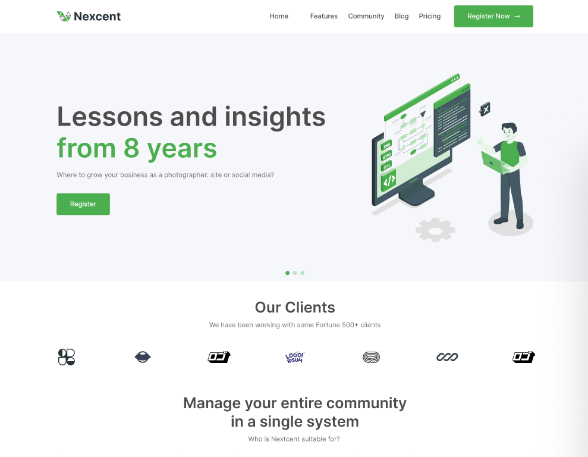

# 💰 Nexcent

**Design on Figma: [click here.](<https://www.figma.com/file/pbLcZRXajXTstehUxaSoca/Responsive-Landing-Page-Design-%7C-Website-Home-Page-Design-%7C-Agency-Website-UI-Design-(Community)?type=design&node-id=1-2&mode=design&t=KUzdw8olQvWijYNE-0>)**

_OBS: I did not create the design. I just implemented it with my coding skills._

## ▶ Desktop / Mobile View

## 🔗 Deploy

**Access the Nexcent Landing Page Website:** [click here.](https://nexcents.vercel.app/)
